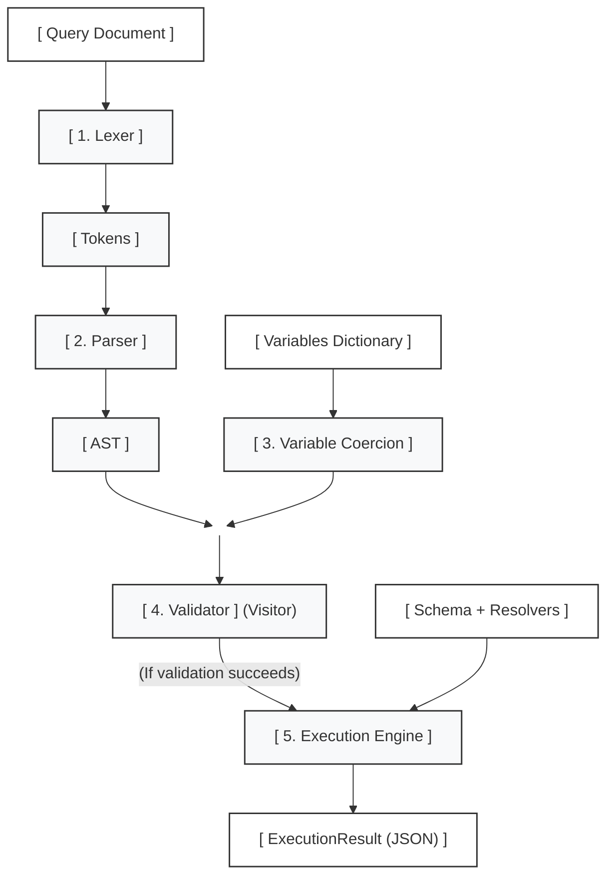

# 🌰 Hazelnut_QL

> **Autonomous Algorithmic GraphQL Execution Engine for .NET**
>
> Implemented as a pure Class Library with zero dependencies on third-party frameworks, database ORMs, HTTP transports, or reflection.

[](#-testing-strategy)
[](#-testing-strategy)
[](LICENSE)

---

## 📌 Overview

**Hazelnut_QL** is a high-performance, deterministic GraphQL execution engine designed according to the official GraphQL specification. Built from the ground up, it handles the entire query lifecycle—from lexical scanning and recursive descent syntax parsing to static validation and asynchronous tree execution.

This project is an algorithmic compiler frontend and tree evaluator engineered with structural safety, type soundess, and predictability at its core:

* **No Reflection Overhead (`System.Reflection`):** Schema definitions and resolvers are wired explicitly via a declarative Fluent API / Schema Builder, ensuring zero startup scanning cost.
* **Strict Unidirectional Pipeline:** Queries flow deterministically through five discrete, testable pipeline stages.
* **Algorithmic Static Validation:** Queries are analyzed before execution using AST Visitors, including Depth-First Search (DFS) three-color graph cycle detection for fragments.
* **Spec-Compliant Bubble-Up Nullability:** Runtime field resolver failures in non-null contexts cascade safely up the tree according to GraphQL specification semantics.

---

## 🚀 Execution Pipeline

Every GraphQL operation transitions strictly in one direction through five decoupled stages:



### Pipeline Breakdown:

1. **Lexer (Lexical Analysis):** Single-pass Finite State Machine (FSM). Strips comments (`# ...`), whitespace, and commas while tracking accurate line and column coordinates for rich error reporting.
2. **Parser (Syntactic Analysis):** Deterministic Recursive Descent Parser with 1-token lookahead. Translates the token stream into a typed **Abstract Syntax Tree (AST)** rooted at `DocumentNode`.
3. **Variable Coercion:** Validates external input variables against AST `VariableDefinitions`, ensuring type compatibility and injecting default schema values.
4. **Validation Engine:** Visitor-based static analyzer. Enforces leaf field constraints, argument validity, and traverses fragment spreads using a 3-color (White/Gray/Black) DFS graph traversal to catch recursive cycle definitions before running resolvers.
5. **Execution Engine:**
    * **Query:** Evaluates root fields concurrently via asynchronous tasks (`Task.WhenAll`).
    * **Mutation:** Executes root fields in strict serial sequence (`await` loop) to prevent state mutations and race conditions.
    * **Selection Merging:** Combines overlapping selections and fragments at the same depth into unified result sets.
    * **Directive Evaluation:** Inspects `@skip(if: ...)` and `@include(if: ...)` flags before resolving field nodes.
    * **Bubble-up Nullability:** If a field marked as `NonNullType` resolves to `null` or throws an exception, the nullability failure bubbles up recursively to the nearest nullable ancestor.

---

## 🛠 Solution Architecture

To keep boundaries clean and avoid circular build dependencies, the solution is organized into an algorithmic core library, test suites, and a showcase host:

```text
HazelnutQL.sln
│
├── 📁 src/
│   └── 📦 HazelnutQL.Core/             # Pure .NET Class Library (Zero external dependencies)
│       ├── 📁 Parsing/                 # Lexer, Token, TokenKind, SourceLocation
│       ├── 📁 AST/                     # DocumentNode, FieldNode, SelectionSetNode, etc.
│       ├── 📁 Types/                   # Schema, ObjectType, ScalarType, UnionType, Type Modifiers
│       ├── 📁 Validation/              # ValidationEngine, Rules (Visitor, DFS Cycle Detection)
│       ├── 📁 Execution/               # ExecutionEngine, ResolveFieldContext, VariableCoercer
│       └── GraphQLEngine.cs            # Primary facade & pipeline entry point
│
├── 📁 tests/
│   └── 📦 HazelnutQL.Tests/            # Automated test suite (xUnit, FsCheck, Stryker.NET)
│       ├── 📁 Parsing/                 # Boundary token tests and AST verification
│       ├── 📁 Validation/              # Rule compliance & cycle detection tests
│       └── 📁 Execution/               # Resolver resolution, concurrency, and null bubbling
│
└── 📁 samples/
    └── 📦 HazelnutQL.Demo/             # Minimal console/web consumer showcasing the API
        └── Program.cs
```

---

## 🛡 Testing Strategy

Engine correctness and boundary resilience are guaranteed through a three-tier quality verification process:

1. **Unit Testing:**
    * Lexer edge cases (unterminated strings, invalid unicode escapes, unexpected EOF).
    * AST node verification against nested queries, aliases, and inline fragments.
    * Spec-compliant Bubble-up null propagation on resolver exceptions.
2. **Property-Based Testing (FsCheck):**
    * Randomized valid query generators ensuring structural invariants: *the serialized JSON schema shape must strictly mirror the requested AST selection tree*.
    * Deeply nested selection sets to verify immunity to `StackOverflowException`.
3. **Mutation Testing (Stryker.NET):**
    * Automated mutation injection (inverting conditionals, boundary offsets, modifier swaps) across the lexer, parser, and validation engine.
    * High mutation score targets to ensure tests validate domain logic rather than raw line coverage.

---

## 📜 Specification Compliance Matrix

| Feature | Status | Notes |
| :--- | :---: | :--- |
| **Document Parsing** | ✅ | Full support for operations, field aliases, arguments, directives |
| **Fragments** | ✅ | Named fragments and inline type conditionals (`... on Type`) |
| **Cycle Detection** | ✅ | DFS 3-color graph traversal preventing infinite fragment expansion |
| **Scalar Types** | ✅ | `Int`, `Float`, `String`, `Boolean`, `ID` |
| **Type Wrappers** | ✅ | `NonNullType` (`!`) and `ListType` (`[...]`) |
| **Polymorphism** | ✅ | `UnionType` with type resolvers |
| **Execution Order** | ✅ | Parallel `Query` execution (`Task.WhenAll`), sequential `Mutation` |
| **Null Safety** | ✅ | Recursive Bubble-up nullability cascading |
